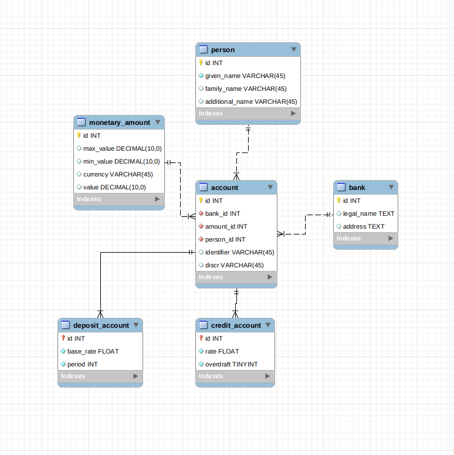

# Bank REST API
Database ER-Diagram


Fake load Command example
```
bin/console bank:load
```

Execute migration to crate tables and data
```
bin/console doctrine:migrations:migrate
```

Get all deposit accounts for a person
```
curl --location 'http://microbank/api/accounts/1'
```
API documentation
```
http://microbank/api/doc
```